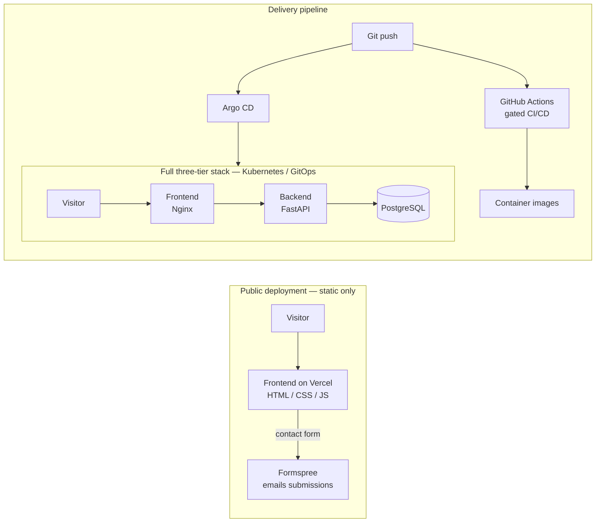

# Biswadip Bhattacharjee — DevOps Portfolio

A personal portfolio that is also a **production-style, three-tier application** — built to
demonstrate real DevOps and platform-engineering practice: containerisation, a Helm-packaged
Kubernetes deployment, GitOps delivery with Argo CD, and a gated DevSecOps CI/CD pipeline.

🌐 **Live site:** [biswadip.online](https://biswadip.online)

> **Two deployment profiles.** The public site is deployed as a **static frontend only** (fast,
> free, zero servers to maintain). The **full three-tier stack** — frontend + FastAPI backend +
> PostgreSQL — is defined in this repository and is designed to run on Kubernetes via GitOps.
> The repo is the showcase; the live site is the shop window.

---

## Architecture



**Tier separation**

| Tier         | Technology                     | Responsibility                                   |
| ------------ | ------------------------------ | ------------------------------------------------ |
| Presentation | HTML / CSS / JS (Nginx)        | The portfolio UI and contact form                |
| Application  | FastAPI (Python), SQLAlchemy   | REST API; persists contact submissions           |
| Data         | PostgreSQL                     | Stores contact-form responses                    |

> **Contact form, by design:** on the **public static site** the form posts to **Formspree** so no
> backend needs to run. In the **full three-tier stack**, the FastAPI backend + PostgreSQL persist
> submissions — demonstrating the complete `frontend → API → database` separation.

---

## DevOps & Platform Stack

| Area                | Tools                                                        |
| ------------------- | ----------------------------------------------------------- |
| Containers          | Docker (multi-stage, non-root images, healthchecks)         |
| Orchestration       | Kubernetes (demonstrated on a local `kind` cluster)         |
| Packaging           | Helm chart (`helm/portfolio`)                                |
| GitOps delivery     | Argo CD — declarative sync, self-heal, auto-prune           |
| Secrets             | Sealed Secrets — encrypted secrets committed safely to Git  |
| CI/CD               | GitHub Actions — build, scan, deploy, gated fail-fast       |
| DevSecOps           | Gitleaks (secret scan), SonarQube Cloud (SAST), Trivy (image scan) |
| Observability       | Prometheus + Grafana (kube-prometheus-stack, via Argo CD)   |
| Cloud               | AWS                                                          |
| Languages           | Python, Java, Kotlin                                         |

---

## CI/CD Pipeline (GitHub Actions)

The pipeline follows one principle: **CI updates Git; Argo CD deploys from Git.** CI never touches
the cluster, so no cluster credentials live in CI. Every stage is a **blocking gate** — a build is
only pushed if all checks pass.

```
push → ┌ secret-scan  (Gitleaks)        ┐
       ├ dockerfile-lint (Hadolint)     ├─ all must pass ─→ build → Trivy scan → push image
       └ sast (SonarQube quality gate)  ┘                                          │
                                                                                   ▼
                                              update image tags in Git ([skip ci]) → Argo CD → Healthy
```

- Images are tagged with the commit SHA (never `latest`).
- Every GitHub Action is pinned to an immutable commit SHA (supply-chain hardening).

---

## GitOps with Argo CD

- An Argo CD `Application` watches this repo (`helm/portfolio`) and keeps the `portfolio` namespace
  in sync with Git — **automated sync, self-heal, and prune** are enabled.
- Database credentials are stored as a **Sealed Secret**: encrypted at rest and safe to commit,
  decrypted only inside the cluster by the controller.
- Monitoring (`kube-prometheus-stack`) is itself installed **through Argo CD**, so the observability
  layer is GitOps-managed too, with Grafana dashboards for cluster and Argo CD health.

---

## Repository structure

```
.
├── frontend/            # Static site (HTML/CSS/JS) — deployed publicly on Vercel
├── backend/             # FastAPI + SQLAlchemy application (contact API)
├── helm/portfolio/      # Helm chart: frontend, backend, postgres, config, sealed secret
├── k8s/                 # kind cluster config and Kubernetes manifests
├── argocd/              # Argo CD Application manifests (app + monitoring)
├── .github/workflows/   # CI/CD pipeline
├── docker-compose.yml   # Local full-stack run (frontend + backend + postgres)
└── sonar-project.properties
```

---

## Running it

**1. Frontend only (fastest — what's deployed publicly)**
```bash
# open frontend/index.html with the VS Code "Live Server" extension,
# or serve it with any static server
```

**2. Full three-tier stack locally (Docker Compose)**
```bash
docker compose up --build
# frontend + FastAPI backend + PostgreSQL, wired together
```

**3. Full GitOps deployment (Kubernetes)**
```bash
# create the kind cluster
kind create cluster --config k8s/kind-cluster.yaml
# install Argo CD, then apply the Application — Argo CD deploys the Helm chart
kubectl apply -f argocd/application.yaml
```

---

## Roadmap

- [ ] Cloud deployment on **AWS EKS**, provisioned with **Terraform**
- [ ] **OWASP ZAP** (DAST) and **Dependency-Check** (SCA) stages in CI
- [ ] Alertmanager → Slack notifications
- [ ] Dependabot for pinned action SHAs

---

## Contact

- **Website:** [biswadip.online](https://biswadip.online)
- **GitHub:** [github.com/biswadip98](https://github.com/biswadip98)
- **LinkedIn:** [linkedin.com/in/biswadip-bhattacharjee](https://www.linkedin.com/in/biswadip-bhattacharjee/)

## Credits

The original portfolio was based on a DevOps portfolio template by Aditya, used under the
Apache 2.0 License; the current frontend has since been substantially rebuilt. All infrastructure,
CI/CD, and backend work is my own.
